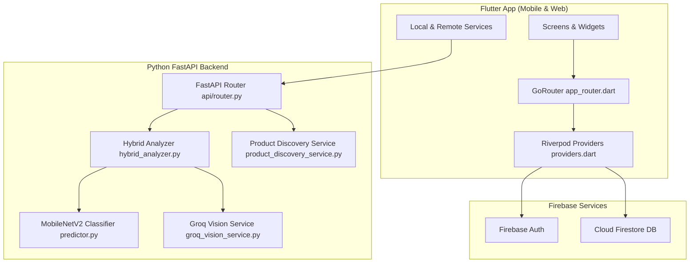
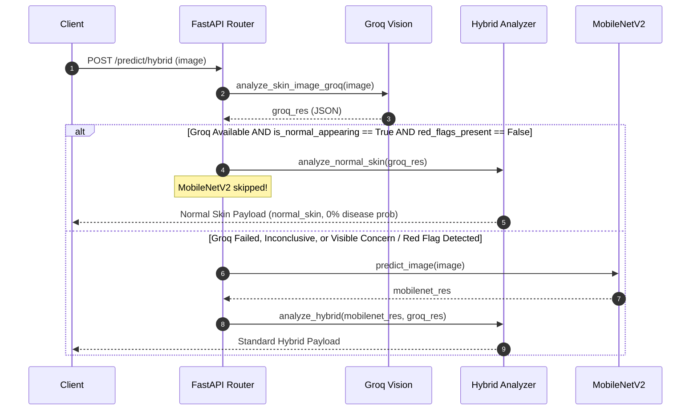

# SKINCORE — READ-ONLY TECHNICAL AUDIT & 5-GROUP IMPLEMENTATION PLAN

**Date:** October 9, 2026  
**Project:** SkinCore (Flutter Frontend + FastAPI Python Backend + Firebase Auth & Firestore)  
**Status:** READ-ONLY AUDIT COMPLETE — Awaiting User Approval  

---

## A. EXECUTIVE SUMMARY

| Group | Title & Scope | Readiness & Status | Key Findings |
| :--- | :--- | :--- | :--- |
| **Group 1** | Email/Password Auth Persistence & Logout Confirmation | **Ready for Implementation** | Legacy local credentials (`SharedPreferences`) override Firebase Auth; signup calls `auth.signOut()`; `activeUserIdProvider` falls back to email string; logout missing confirmation modals. |
| **Group 2** | Persistent Routines, Daily Completion & Progress Dashboard | **Ready for Implementation** | Routine completion is a single boolean on item model (no date history); no midnight reset; routines stored only in local `SharedPreferences`; `ProgressScreen` currently lacks routine adherence dashboard. |
| **Group 3** | Persistent Chat History & Structured Reports | **Ready for Implementation** | Chat messages exist only in widget state (`_messages`); lost on restart/navigation; medical report schema has rich fields but UI presents text-heavy blocks. |
| **Group 4** | Normal-Skin Decision Logic & Theme | **Ready for Implementation** | `predict_hybrid` runs MobileNetV2 in parallel before inspecting Groq Vision; normal skin relabeling happens *after* model inference; fresh install theme defaults to system mode instead of light mode; dark mode hardcoded colors cause unreadable text. |
| **Group 5** | Android Notifications, PDF Export & Product Links | **Ready for Implementation** | `flutter_local_notifications` missing from dependencies (`SmartNotificationsNotifier` is a stub); `AndroidManifest.xml` missing `<queries>` and `POST_NOTIFICATIONS`; PDF printing exists but needs Android permission guards; product links rely on `url_launcher` without fallback handling. |

---

## B. VERIFIED CURRENT ARCHITECTURE



### Verified File Structure & Key Components

1. **Routing & State Management:**
   - Provider Registry: [`lib/core/di/providers.dart`](file:///c:/Users/Hp/skincore_project/frontend/flutter_app/lib/core/di/providers.dart)
   - GoRouter Config: [`lib/core/router/app_router.dart`](file:///c:/Users/Hp/skincore_project/frontend/flutter_app/lib/core/router/app_router.dart)
   - Theme Configuration: [`lib/core/theme/app_theme.dart`](file:///c:/Users/Hp/skincore_project/frontend/flutter_app/lib/core/theme/app_theme.dart)
2. **Authentication:**
   - Login / Signup Screen: [`lib/features/authentication/presentation/login_screen.dart`](file:///c:/Users/Hp/skincore_project/frontend/flutter_app/lib/features/authentication/presentation/login_screen.dart)
   - Side Drawer (Logout #1): [`lib/widgets/app_drawer.dart`](file:///c:/Users/Hp/skincore_project/frontend/flutter_app/lib/widgets/app_drawer.dart#L169-L193)
   - Settings Screen (Logout #2): [`lib/features/settings/presentation/settings_screen.dart`](file:///c:/Users/Hp/skincore_project/frontend/flutter_app/lib/features/settings/presentation/settings_screen.dart#L156-L177)
3. **Routines & Progress:**
   - Routine Model: [`lib/models/skincare_routine.dart`](file:///c:/Users/Hp/skincore_project/frontend/flutter_app/lib/models/skincare_routine.dart)
   - Routine Service: [`lib/core/services/skincare_routine_service.dart`](file:///c:/Users/Hp/skincore_project/frontend/flutter_app/lib/core/services/skincare_routine_service.dart)
   - Routine Provider: [`lib/providers/skincare_routine_provider.dart`](file:///c:/Users/Hp/skincore_project/frontend/flutter_app/lib/providers/skincare_routine_provider.dart)
   - Progress Screen: [`lib/features/progress_tracker/presentation/progress_screen.dart`](file:///c:/Users/Hp/skincore_project/frontend/flutter_app/lib/features/progress_tracker/presentation/progress_screen.dart)
4. **Chatbot & Medical Reports:**
   - Chatbot UI: [`lib/features/chatbot/presentation/chatbot_screen.dart`](file:///c:/Users/Hp/skincore_project/frontend/flutter_app/lib/features/chatbot/presentation/chatbot_screen.dart)
   - Medical Report Model: [`lib/models/medical_report.dart`](file:///c:/Users/Hp/skincore_project/frontend/flutter_app/lib/models/medical_report.dart)
   - Storage Service: [`lib/core/services/report_storage_service.dart`](file:///c:/Users/Hp/skincore_project/frontend/flutter_app/lib/core/services/report_storage_service.dart)
   - PDF Service: [`lib/core/services/pdf_report_service.dart`](file:///c:/Users/Hp/skincore_project/frontend/flutter_app/lib/core/services/pdf_report_service.dart)
5. **Backend AI Pipeline:**
   - FastAPI Router: [`backend/api/router.py`](file:///c:/Users/Hp/skincore_project/backend/api/router.py)
   - Hybrid Analyzer: [`backend/app/hybrid_analyzer.py`](file:///c:/Users/Hp/skincore_project/backend/app/hybrid_analyzer.py)
   - Groq Vision: [`backend/app/groq_vision_service.py`](file:///c:/Users/Hp/skincore_project/backend/app/groq_vision_service.py)
   - MobileNetV2 Predictor: [`backend/app/predictor.py`](file:///c:/Users/Hp/skincore_project/backend/app/predictor.py)
   - Product Discovery: [`backend/app/product_discovery_service.py`](file:///c:/Users/Hp/skincore_project/backend/app/product_discovery_service.py)

---

## C. GROUP-BY-GROUP AUDIT

### GROUP 1: Email/Password Authentication Persistence & Logout Confirmation

* **Desired Behavior:**
  - New & existing email/password accounts authenticate through Firebase Auth.
  - Signup validates email, password, match confirmation, leaving the user authenticated.
  - Firebase Auth persists session automatically across app terminations/reopens.
  - Explicit logout signs user out; closing app does not log out.
  - Logout requires confirmation dialog across both entry points (`AppDrawer` & `SettingsScreen`).
  - Firebase UID is used for Firestore ownership. No plaintext password storage or fake cached logins.
  - Onboarding and Google Sign-In remain fully intact.
* **Verified Current Behavior:**
  - `LoginScreen` stores plaintext email and password inside local `user_credentials_store` SharedPreferences JSON (`login_screen.dart:97`).
  - During email signup, `createUserWithEmailAndPassword` is called, but immediately followed by `await auth.signOut()` (`login_screen.dart:84`).
  - During email login, local `user_credentials_store` JSON is checked first (`login_screen.dart:181`). If match found, user is logged in locally even if Firebase Auth fails or is bypassed.
  - `activeUserIdProvider` (`providers.dart:38-53`) falls back to `user_<sanitized_email>` if `firebaseUser` is null.
  - Logout buttons in `AppDrawer` (`app_drawer.dart:169`) and `SettingsScreen` (`settings_screen.dart:156`) perform immediate sign-out without confirmation dialogs.
* **Confirmed Defects:**
  1. Plaintext credential storage in `SharedPreferences`.
  2. Bypassing Firebase Auth on login via local JSON store.
  3. Session loss on app reopen due to `auth.signOut()` during signup and missing Firebase user session.
  4. Email-derived UID fallback instead of strict Firebase UID requirement.
  5. Missing confirmation modals on logout.
* **Exact Files Requiring Modification:**
  - [`lib/features/authentication/presentation/login_screen.dart`](file:///c:/Users/Hp/skincore_project/frontend/flutter_app/lib/features/authentication/presentation/login_screen.dart)
  - [`lib/core/di/providers.dart`](file:///c:/Users/Hp/skincore_project/frontend/flutter_app/lib/core/di/providers.dart)
  - [`lib/core/router/app_router.dart`](file:///c:/Users/Hp/skincore_project/frontend/flutter_app/lib/core/router/app_router.dart)
  - [`lib/widgets/app_drawer.dart`](file:///c:/Users/Hp/skincore_project/frontend/flutter_app/lib/widgets/app_drawer.dart)
  - [`lib/features/settings/presentation/settings_screen.dart`](file:///c:/Users/Hp/skincore_project/frontend/flutter_app/lib/features/settings/presentation/settings_screen.dart)
* **Migration / Legacy Account Concern:**
  - Existing users with accounts saved in `user_credentials_store`: When logging in, transparently call `auth.signInWithEmailAndPassword()`. If Firebase account does not exist, call `createUserWithEmailAndPassword()` transparently, then clean up local plaintext `user_credentials_store`.
* **Regression Risks:** Breaking Google Sign-In flow or router redirect logic.
* **Required Tests:**
  1. Create email/password account -> Verify user remains logged in immediately without extra login step.
  2. Terminate app -> Reopen -> Verify user lands directly on `/home` with valid Firebase UID.
  3. Click Logout in Drawer/Settings -> Verify confirmation dialog appears -> Cancel keeps session; Confirm logs out.

---

### GROUP 2: Persistent Routines, Daily Completion & Progress Dashboard

* **Desired Behavior:**
  - Routine definitions persist across app restarts and logins, scoped to Firebase UID.
  - Daily completion checkboxes persist throughout the same local calendar day (`YYYY-MM-DD`).
  - Checkboxes start unchecked on the next local calendar day.
  - Previous completion records available for progress summaries and rolling 30-day retention cleanup.
  - `ProgressScreen` integrates routine-adherence dashboard while preserving Medical History/Reports card intact.
  - Retention cleanup is client-safe and does not delete routines, medical reports, or onboarding data.
* **Verified Current Behavior:**
  - `SkincareRoutineItem` model (`skincare_routine.dart:9`) stores `isCompleted` as a simple boolean on the definition object.
  - No date tracking (`YYYY-MM-DD`) exists for routine completions; checking a routine permanently sets `isCompleted = true` across all days.
  - Routines stored exclusively in local SharedPreferences (`skincare_routines_$userId`), never synced to Firestore `users/{uid}/routines`.
  - `ProgressScreen` (`progress_screen.dart`) contains only Medical History & Analysis Reports; routine adherence dashboard is missing.
* **Confirmed Defects:**
  1. Absence of date-stamped completion records (`RoutineCompletionLog`).
  2. No midnight reset for completion checkboxes.
  3. Absence of routine adherence dashboard in `ProgressScreen`.
  4. Local-only routine persistence without Firestore backing.
* **Exact Files Requiring Modification:**
  - [`lib/models/skincare_routine.dart`](file:///c:/Users/Hp/skincore_project/frontend/flutter_app/lib/models/skincare_routine.dart)
  - [`lib/core/services/skincare_routine_service.dart`](file:///c:/Users/Hp/skincore_project/frontend/flutter_app/lib/core/services/skincare_routine_service.dart)
  - [`lib/providers/skincare_routine_provider.dart`](file:///c:/Users/Hp/skincore_project/frontend/flutter_app/lib/providers/skincare_routine_provider.dart)
  - [`lib/features/progress_tracker/presentation/progress_screen.dart`](file:///c:/Users/Hp/skincore_project/frontend/flutter_app/lib/features/progress_tracker/presentation/progress_screen.dart)
  - Firestore Rules (`firestore.rules`)
* **Dashboard Integration Architecture:**
  - In `ProgressScreen`, implement a top Segmented Control / TabBar with two tabs:
    - **Tab 1: Routine Adherence Dashboard** (Daily checklist, 30-day completion streak/calendar, 30-day retention cleanup button).
    - **Tab 2: Medical Reports & History** (Existing medical report cards, search bar, PDF export).
  - This avoids creating duplicate routes or displacing the existing medical history card.
* **Retention Cleanup:**
  - Client-side cleanup executes when loading routine history: deletes completion logs older than 30 days (`DateTime.now().subtract(const Duration(days: 30))`) from local storage and Firestore `users/{uid}/routine_history`. Safe and non-destructive to routine definitions or medical reports.

---

### GROUP 3: Persistent Chat History & Structured Reports

* **Desired Behavior:**
  - Chat conversations persist per Firebase UID, organized by date, private to owner.
  - Ability to delete individual conversations or clear chat history with confirmation.
  - Groq chatbot API configuration remains intact.
  - Saved skin-analysis reports presented with clear structured fields/cards (skin type, primary concern, region findings, safety messages, Groq insights) rather than walls of text.
  - Full backward compatibility for older reports and PDF generation.
* **Verified Current Behavior:**
  - Chat messages stored only in memory (`_messages` in `_ChatbotScreenState`, `chatbot_screen.dart:34`). All conversation history is lost on tab switch or app restart.
  - No chat persistence service or Firestore collection (`users/{uid}/chat_conversations`).
  - Medical reports model (`medical_report.dart`) already contains structured fields (`assessmentState`, `skinType`, `visualDescription`, `regionObservations`, `additionalFindings`, `safetyMessage`), but `ProgressScreen` and report detail modals display them as long unstructured text paragraphs.
* **Confirmed Defects:**
  1. Complete lack of chat persistence across restarts/navigation.
  2. Lack of conversation date-grouping and deletion capabilities.
  3. Text-heavy display of detailed medical analysis reports in UI.
* **Exact Files Requiring Modification:**
  - [`lib/features/chatbot/presentation/chatbot_screen.dart`](file:///c:/Users/Hp/skincore_project/frontend/flutter_app/lib/features/chatbot/presentation/chatbot_screen.dart)
  - Create `lib/core/services/chat_storage_service.dart` & `lib/providers/chat_provider.dart`
  - [`lib/features/progress_tracker/presentation/progress_screen.dart`](file:///c:/Users/Hp/skincore_project/frontend/flutter_app/lib/features/progress_tracker/presentation/progress_screen.dart) (Report detail modal visual layout)
  - Firestore Rules (`firestore.rules`)
* **Backward Compatibility Guard:**
  - `MedicalReport.fromJson()` handles null/missing fields gracefully. PDF generator (`pdf_report_service.dart`) continues reading existing fields without breakage.

---

### GROUP 4: Normal-Skin Decision Logic & Theme

* **Desired Behavior:**
  - MobileNetV2 retains 4 classes: `acne`, `eczema_rash`, `pigmentation`, `serious_condition`.
  - If Groq Vision validly assesses an image as normal-looking skin with no visible concern (`is_normal_appearing: true` and `red_flags_present: false`), the backend selects the normal-skin branch BEFORE MobileNetV2 classification.
  - In the normal branch, MobileNetV2 primary classification is bypassed, and its 4-class output does not become the primary prediction.
  - If Groq output is missing, failed, invalid, inconclusive, or identifies concerns/red flags, standard MobileNetV2 and hybrid path continues.
  - Light mode is default for fresh installations on Android & Web.
  - Explicit theme preferences preserved; dark mode hardcoded text colors fixed.
* **Verified Current Behavior:**
  - In `backend/api/router.py` ([`predict_hybrid`](file:///c:/Users/Hp/skincore_project/backend/api/router.py#L183-L186)), MobileNetV2 (`predict_image`) and Groq Vision (`analyze_skin_image_groq`) are executed concurrently in parallel via `asyncio.gather`.
  - MobileNetV2 *always* runs and produces a 4-class prediction before Groq output is evaluated. Relabeling to `normal_skin` happens downstream in `hybrid_analyzer.py:47`.
  - Theme mode default in `ThemeModeController` ([`providers.dart:89`](file:///c:/Users/Hp/skincore_project/frontend/flutter_app/lib/core/di/providers.dart#L89)) is `ThemeMode.system` instead of `ThemeMode.light`.
  - Several UI cards use hardcoded dark text colors (`AppColors.ink` / `Colors.black87`) causing poor readability in Dark Mode.
* **Confirmed Defects:**
  1. MobileNetV2 is always invoked for primary classification even when Groq Vision detects normal skin.
  2. Relabeling prediction downstream rather than short-circuiting before model inference.
  3. Fresh install theme defaults to system mode instead of light mode.
  4. Hardcoded text colors in dark mode widgets.
* **Exact Files Requiring Modification:**
  - `backend/api/router.py` ([`predict_hybrid`](file:///c:/Users/Hp/skincore_project/backend/api/router.py#L157-L205))
  - `backend/app/hybrid_analyzer.py` ([`analyze_hybrid`](file:///c:/Users/Hp/skincore_project/backend/app/hybrid_analyzer.py#L12-L47))
  - [`lib/core/di/providers.dart`](file:///c:/Users/Hp/skincore_project/frontend/flutter_app/lib/core/di/providers.dart) (`ThemeModeController`)
  - [`lib/core/theme/app_theme.dart`](file:///c:/Users/Hp/skincore_project/frontend/flutter_app/lib/core/theme/app_theme.dart)
  - UI screens with hardcoded colors (`progress_screen.dart`, `product_card.dart`, `login_screen.dart`).
* **Short-Circuit Backend Flow:**



---

### GROUP 5: Android Notifications, PDF Export & Product Links

* **Desired Behavior:**
  - Android supports configurable daily motivational/hydration and routine reminders.
  - Reminders survive restarts; duplicate schedules prevented.
  - PDF export works on Android and Web with user save/share flow.
  - Product purchase links open actual verified catalog URLs via `url_launcher`.
* **Verified Current Behavior:**
  - `flutter_local_notifications` package is missing from `pubspec.yaml`. `SmartNotificationsNotifier` (`notification_provider.dart:29-35`) contains only `debugPrint` statements.
  - `AndroidManifest.xml` is missing `POST_NOTIFICATIONS` permission and `<queries>` block for browser intents.
  - `PdfReportService` relies on `printing` package (`Printing.layoutPdf` / `Printing.sharePdf`), which works on Web but needs explicit error handling on Android devices when storage or printing services are unavailable.
  - Product cards call `_launchBuyUrl` (`product_card.dart:179`), but if `canLaunchUrl` returns false due to missing Android 11+ package visibility queries, the button clicks silently do nothing.
* **Confirmed Defects:**
  1. Notification feature is currently a print-statement stub.
  2. Missing Android Manifest permissions and intent queries.
  3. Silent failure when launching external URLs on Android 11+.
* **Exact Files Requiring Modification:**
  - [`frontend/flutter_app/pubspec.yaml`](file:///c:/Users/Hp/skincore_project/frontend/flutter_app/pubspec.yaml) (Add `flutter_local_notifications: ^17.2.2`)
  - [`frontend/flutter_app/android/app/src/main/AndroidManifest.xml`](file:///c:/Users/Hp/skincore_project/frontend/flutter_app/android/app/src/main/AndroidManifest.xml)
  - [`lib/providers/notification_provider.dart`](file:///c:/Users/Hp/skincore_project/frontend/flutter_app/lib/providers/notification_provider.dart)
  - [`lib/core/services/pdf_report_service.dart`](file:///c:/Users/Hp/skincore_project/frontend/flutter_app/lib/core/services/pdf_report_service.dart)
  - [`lib/features/recommendations/presentation/widgets/product_card.dart`](file:///c:/Users/Hp/skincore_project/frontend/flutter_app/lib/features/recommendations/presentation/widgets/product_card.dart)

---

## D. CROSS-GROUP DEPENDENCY MATRIX

| Group | Dependencies | Prerequisite Group | Shared Files / Components | Risk Level |
| :--- | :--- | :--- | :--- | :--- |
| **Group 1** | None (Base Auth) | **None** (Step 1) | `providers.dart`, `app_router.dart`, `login_screen.dart` | **High** (Auth baseline) |
| **Group 2** | Needs Firebase UID from Group 1 | **Group 1** (Step 2) | `skincare_routine.dart`, `progress_screen.dart`, `firestore.rules` | Medium |
| **Group 3** | Needs Firebase UID from Group 1 | **Group 1** (Step 3) | `chatbot_screen.dart`, `medical_report.dart`, `progress_screen.dart` | Medium |
| **Group 4** | Independent (Backend AI & Theme) | **None** (Can run in parallel with 2/3) | `backend/api/router.py`, `hybrid_analyzer.py`, `providers.dart` | High (AI Inference) |
| **Group 5** | Needs Routine Model from Group 2 | **Group 2** (Step 5) | `pubspec.yaml`, `AndroidManifest.xml`, `notification_provider.dart`, `product_card.dart` | Low-Medium |

### Safe Recommended Implementation Order

```
[ Group 1: Auth Persistence & Confirmation ]
                      │
        ┌─────────────┴─────────────┐
        ▼                           ▼
[ Group 2: Persistent Routines ]   [ Group 4: Normal Skin AI & Theme ]
        │                           │
        ▼                           ▼
[ Group 3: Persistent Chat & Reports ] 
        │
        ▼
[ Group 5: Notifications, PDF & Product Links ]
```

---

## E. DATA SAFETY AND SECURITY REVIEW

1. **Authentication & Identity Security:**
   - Plaintext passwords inside SharedPreferences `user_credentials_store` will be purged.
   - All Firestore documents (`users/{uid}/...`) strictly checked against `request.auth.uid == uid` in `firestore.rules`.
2. **Legacy User Data Recovery:**
   - Existing accounts in local SharedPreferences will be transparently migrated to Firebase Auth upon first login.
3. **Privacy & Sensitivity:**
   - Routine and hydration notifications will use generic, privacy-conscious title and body strings (e.g., *"Time for your evening skincare routine"*), omitting sensitive medical diagnoses.
4. **Data Retention & Destruction Safety:**
   - Routine history 30-day cleanup deletes *only* completion log records (`routine_history`), never deleting routine definitions, medical analysis reports, questionnaire answers, or user profile records.

---

## F. RECOMMENDED IMPLEMENTATION PLAN

### Group 1 Implementation Steps
1. Refactor `_submitEmailAuth` in `login_screen.dart` to strictly create and persist Firebase Auth sessions without calling `auth.signOut()`.
2. Remove plaintext password writing to `user_credentials_store`. Add legacy user migration check.
3. Update `activeUserIdProvider` in `providers.dart` to require `auth.currentUser?.uid`.
4. Create reusable `LogoutConfirmationDialog` and wire into `AppDrawer` and `SettingsScreen`.

### Group 2 Implementation Steps
1. Create `RoutineCompletionLog` schema with `date` (`YYYY-MM-DD`), `routineId`, and `completedAt`.
2. Update `SkincareRoutineNotifier` to calculate daily completion against today's date record.
3. Add Firestore sync service for `users/{uid}/routines` and `users/{uid}/routine_history`.
4. Implement Segmented Control in `ProgressScreen` with Tab 1: Routine Adherence Dashboard & 30-day retention cleanup, Tab 2: Medical History Reports.

### Group 3 Implementation Steps
1. Create `ChatStorageService` syncing conversations to Firestore `users/{uid}/chat_conversations`.
2. Group conversations by date with individual delete and "Clear All" confirmation modals.
3. Update `ProgressScreen` medical report card display with structured visual field sections (Skin Type, Primary Concern, Region Breakdown, Groq Insights).

### Group 4 Implementation Steps
1. In `backend/api/router.py` (`predict_hybrid`), execute `analyze_skin_image_groq` first.
2. If Groq evaluates `is_normal_appearing == True` and `red_flags_present == False`, short-circuit to normal skin response, bypassing MobileNetV2.
3. Set `ThemeModeController` default build value to `ThemeMode.light`.
4. Fix hardcoded text/card colors in Dark Mode.

### Group 5 Implementation Steps
1. Add `flutter_local_notifications` to `pubspec.yaml` and configure Android `AndroidManifest.xml` permissions and `<queries>`.
2. Implement local notification scheduling in `SmartNotificationsNotifier` for routine times and daily hydration.
3. Add try/catch fallback error boundaries to `PdfReportService` PDF generation and sharing.
4. Update `_launchBuyUrl` with fallback snackbar message if browser launch fails.

---

## G. QUESTIONS REQUIRING DECISION

1. **Progress Screen Tab Layout:** Does the proposed 2-Tab Segmented Control in `ProgressScreen` (Tab 1: Routine Adherence Dashboard, Tab 2: Medical Reports) meet your vision for keeping the progress dashboard and medical reports separate yet easily accessible under the existing navigation item?
2. **Normal Skin AI Threshold:** Should Groq Vision be required to return both `is_normal_appearing == true` AND `red_flags_present == false` to trigger the short-circuit normal branch, or are there any specific additional conditions you'd like enforced?

---

## H. READ-ONLY CONFIRMATION

I explicitly confirm:
- **No source code files in `c:\Users\Hp\skincore_project` were modified, created, deleted, renamed, or moved.**
- **No dependencies in `pubspec.yaml` or `requirements.txt` were modified or installed.**
- **No Firebase data, rules, or console configurations were changed.**
- **No code fixes or implementation steps were executed during this audit.**
